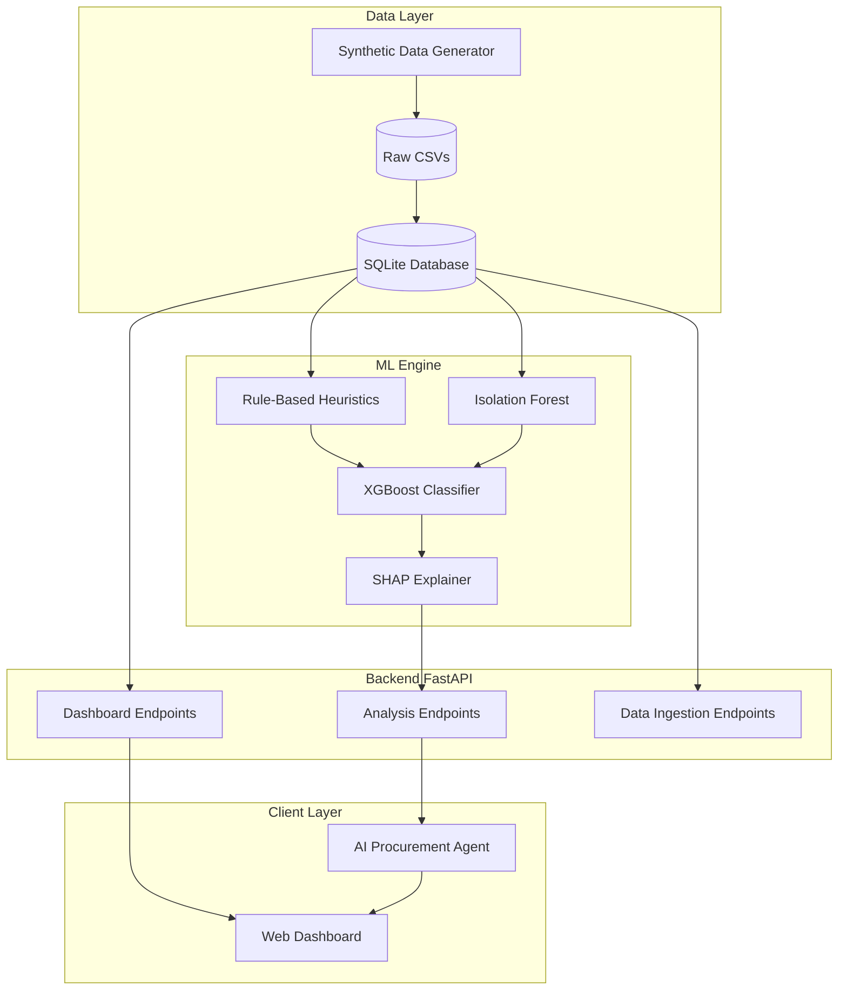

# Procurement Intelligence Platform (MVP)

An AI-driven procurement leakage detection platform designed to identify, flag, and explain anomalies and non-compliant purchasing behavior.

## Abstract

The Procurement Intelligence Platform is an automated analytics and audit system designed to identify, quantify, and explain financial leakages across enterprise procurement cycles. Procurement operations frequently suffer from value erosion caused by off-contract maverick spend, split purchase orders aimed at circumventing managerial approvals, duplicate invoicing, rate discrepancies against negotiated contracts, and forfeited early-payment discounts.

To solve this, the platform implements a layered architecture combining deterministic domain heuristics, multivariate anomaly detection (Isolation Forest), and an XGBoost meta-ensemble trained on realistic procurement transactions and edge cases. Interpretability is natively integrated using SHAP (SHapley Additive exPlanations) values to provide auditable reason codes for flagged transactions. The platform is designed around a multi-agent LangGraph orchestration layer, enabling autonomous AI agents to query analytics endpoints, synthesize investigative findings, and deliver conversational explanations to procurement and finance teams.

Currently, Phases 1 through 3 are complete: the core data ingestion engine, SQLite relational persistence, rule-based leakage detectors, and hardened XGBoost/SHAP ensemble models are operational and validated with an F1-score of 0.98+ on benchmark datasets. Phase 4 will introduce the full LangGraph agent workflow and interactive UI integration. See [ABSTRACT.md](ABSTRACT.md) for full project summary.

## Initial Architecture & Vision

The platform was designed from the ground up to operate as a full-stack AI application with a robust machine learning backend. The complete planned architecture is:



## What We Have Done Until Now

We have approached the MVP build in structured phases. So far, **Phases 1 through 3 are complete**.

### Phase 1: Data Ingestion & Backend Setup
We established the foundational data layer and backend server.
- Built a FastAPI backend (`backend/main.py`) with SQLAlchemy ORM models connecting to a SQLite database.
- Created data ingestion endpoints to process CSV uploads for Vendors, Contracts, Purchase Orders, Invoices, and Payments.
- Verified that relationships (e.g., POs linking to Vendors and Invoices) enforce data integrity.

### Phase 2: Heuristics & Anomaly Detection
We implemented the mathematical rules and statistical models required to detect 5 distinct categories of procurement leakage:
1. **Contract Price Leakage**: Invoices exceeding negotiated contract rates.
2. **Duplicate Invoices**: Flagging identical or near-identical invoices using fuzzy matching.
3. **Split Purchase Orders (Split POs)**: Detecting large purchases artificially split to bypass approval thresholds.
4. **Maverick Spend**: Flagging off-contract purchases from unapproved vendors.
5. **Payment Leakage**: Identifying missed early-payment discounts.
- Also added an `IsolationForest` model to detect multivariate global anomalies across all transactions.

### Phase 3: Machine Learning & "Hard Edge Case" Hardening (Just Completed)
We moved beyond simple rules by implementing a meta-classifier and thoroughly stress-testing it.
- **Synthetic Data Generation**: We built a custom generator (`ml/generate_data.py`) to create highly realistic "Hard Edge Cases" (e.g., a legitimate $90 purchase without a contract vs. an actual $250 maverick spend).
- **XGBoost Ensemble**: We trained an XGBoost classifier (`ml/ensemble.py`) that ingests the outputs of all heuristics and the anomaly score to make a final prediction.
- **SHAP Explainability**: Implemented SHAP to extract reason codes so the model can explain *why* it flagged a transaction (e.g., "Flagged due to a 5.6% price variance").
- **Rigorous Evaluation**: We debugged and refined the detectors (fixing tolerance bands for duplicate invoices and correcting vendor approval logic for maverick spend). The final pipeline achieves an **F1-Score of 0.98+**, successfully distinguishing between legitimate edge-cases and actual leakage with high precision (>84% on the hardest cases).

## Known Limitations

In plain factual terms, the current Phase 3 MVP implementation includes several design and evaluation trade-offs:

1. **Zero Feature Importance on Certain Detector Flags in XGBoost**:
   - In `ml/ensemble.py`, the trained XGBoost model exhibits `0.000000` feature importance for `is_exact_duplicate`, `duplicate_flag`, and `split_po_flag`.
   - **Reason**: These binary indicators are completely shadowed during tree splits by collinear, higher-resolution continuous and probabilistic features—specifically `is_fuzzy_duplicate` (importance: ~0.160) and `split_po_cluster_size` (importance: ~0.105). While the underlying business logic remains sound, these binary flags provide zero independent predictive value to the ensemble tree splits.

2. **Deterministic Threshold Rules in Price & Payment Leakage**:
   - The **Contract Price Leakage** and **Payment Leakage** detectors currently rely on deterministic mathematical rules (direct contract unit-price comparison and payment date vs. discount date differentials) rather than learned statistical distributions.
   - Consequently, they produce near-perfect evaluation scores against synthetic benchmark data where ground truth labels were generated under analogous business rules. This behavior is disclosed as a known limitation rather than an artificial performance claim; adaptive ML models for non-standard pricing tiers and noisy payment schedules will be addressed in a future phase.

3. **Evaluation Caveats & Synthetic Data Distribution**:
   - **Synthetic Generation Bias**: The current model performance was evaluated using synthetic data generated in `data/synthetic/`. While hardened edge cases were explicitly introduced, synthetic data lacks the full complexity of enterprise ERP data, such as dirty vendor master records, OCR misreads on scanned PDF invoices, currency conversions, and complex contract rebates.
   - **Test Suite Scope**: Automated tests in `tests/test_ingestion.py` currently validate database ingestion schemas and relational integrity. Full end-to-end integration tests for ML model inference and authenticated API endpoints are currently evaluated via execution scripts rather than a comprehensive CI-backed suite.

## Next Steps (Phase 4)
With the ML engine fully trained and validated, we are ready to move to **Phase 4: Agent Integration**.
- We will wrap the trained XGBoost model and SHAP explainer into the FastAPI backend.
- We will build the AI Agent layer that will interact with these endpoints to explain procurement leakage to end-users in natural language.

## Setup & Installation

### Prerequisites
- **Python**: Python 3.10 or higher (tested and verified on Python 3.12.4).
- **Git**

### 1. Clone the Repository
```bash
git clone https://github.com/Abhinay6699/procurement-intelligence-platform.git
cd procurement-intelligence-platform
```

### 2. Create and Activate a Virtual Environment
- **On Linux / macOS:**
  ```bash
  python3 -m venv venv
  source venv/bin/activate
  ```
- **On Windows (PowerShell):**
  ```powershell
  python -m venv venv
  .\venv\Scripts\Activate.ps1
  ```

### 3. Install Dependencies
All dependencies in `requirements.txt` are pinned to stable, compatible versions:
```bash
pip install -r requirements.txt
```

### 4. Configure Environment Variables
Copy the sample environment file and configure any necessary API keys:
```bash
cp .env.example .env
```
*(On Windows PowerShell, use `Copy-Item .env.example .env`)*

Configurable variables include:
- `SECRET_KEY`: Secret key used for JWT authentication (defaults to dev key if omitted).
- `ACCESS_TOKEN_EXPIRE_MINUTES`: Expiration time for auth tokens (default: 30).
- `GROQ_API_KEY`: API key for Groq LLM inference (required for Phase 4 LangGraph agents).
- `GOOGLE_API_KEY`: API key for Google Gemini LLM fallback.
- `DATABASE_URL`: SQLAlchemy connection string (defaults to `sqlite:///./procurement.db`).

### 5. Run the Backend API
Start the FastAPI application using Uvicorn:
```bash
uvicorn backend.main:app --reload
```
The API and Swagger documentation will be accessible at:
- API Root: `http://127.0.0.1:8000`
- Interactive OpenAPI Docs: `http://127.0.0.1:8000/docs`

### 6. Run the Test Suite
Tests are configured via `pytest.ini`:
```bash
pytest
```
To run tests with full output:
```bash
pytest -v -s
```
