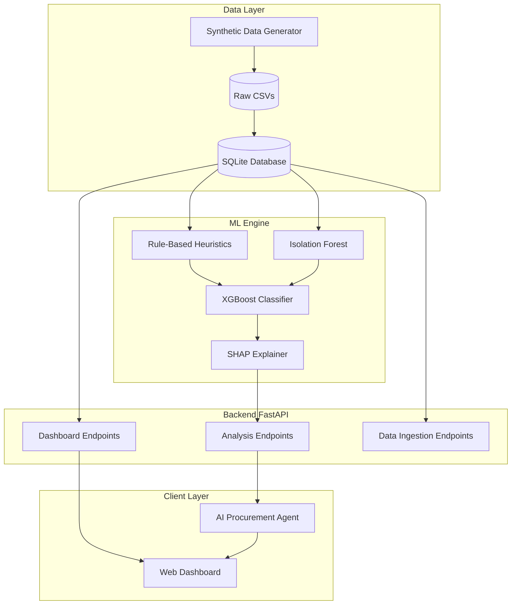

# Procurement Intelligence Platform (MVP)

An AI-driven procurement leakage detection platform designed to identify, flag, and explain anomalies and non-compliant purchasing behavior.

## Initial Architecture & Vision

The platform was designed from the ground up to operate as a full-stack AI application with a robust machine learning backend. The complete planned architecture is:

## What We Have Done Until Now

We have approached the MVP build in structured phases. So far, **Phases 1 through 3 are complete**.

### Phase 1: Data Ingestion & Backend Setup
We established the foundational data layer and backend server.
- Built a FastAPI backend (`backend/main.py`) with SQLAlchemy ORM models connecting to a SQLite database.
- Created data ingestion endpoints to process CSV uploads for Vendors, Contracts, Purchase Orders, Invoices, and Payments.
- Verified that relationships (e.g., POs linking to Vendors and Invoices) enforce data integrity.

### Phase 2: Heuristics & Anomaly Detection
We implemented the mathematical rules and statistical models required to detect 5 distinct categories of procurement leakage:
1. **Contract Price Leakage**: Invoices exceeding negotiated contract rates.
2. **Duplicate Invoices**: Flagging identical or near-identical invoices using fuzzy matching.
3. **Split Purchase Orders (Split POs)**: Detecting large purchases artificially split to bypass approval thresholds.
4. **Maverick Spend**: Flagging off-contract purchases from unapproved vendors.
5. **Payment Leakage**: Identifying missed early-payment discounts.
- Also added an `IsolationForest` model to detect multivariate global anomalies across all transactions.

### Phase 3: Machine Learning & "Hard Edge Case" Hardening (Just Completed)
We moved beyond simple rules by implementing a meta-classifier and thoroughly stress-testing it.
- **Synthetic Data Generation**: We built a custom generator (`ml/generate_data.py`) to create highly realistic "Hard Edge Cases" (e.g., a legitimate $90 purchase without a contract vs. an actual $250 maverick spend).
- **XGBoost Ensemble**: We trained an XGBoost classifier (`ml/ensemble.py`) that ingests the outputs of all heuristics and the anomaly score to make a final prediction.
- **SHAP Explainability**: Implemented SHAP to extract reason codes so the model can explain *why* it flagged a transaction (e.g., "Flagged due to a 5.6% price variance").
- **Rigorous Evaluation**: We debugged and refined the detectors (fixing tolerance bands for duplicate invoices and correcting vendor approval logic for maverick spend). The final pipeline achieves an **F1-Score of 0.98+**, successfully distinguishing between legitimate edge-cases and actual leakage with high precision (>84% on the hardest cases).

## Next Steps (Phase 4)
With the ML engine fully trained and validated, we are ready to move to **Phase 4: Agent Integration**.
- We will wrap the trained XGBoost model and SHAP explainer into the FastAPI backend.
- We will build the AI Agent layer that will interact with these endpoints to explain procurement leakage to end-users in natural language.
